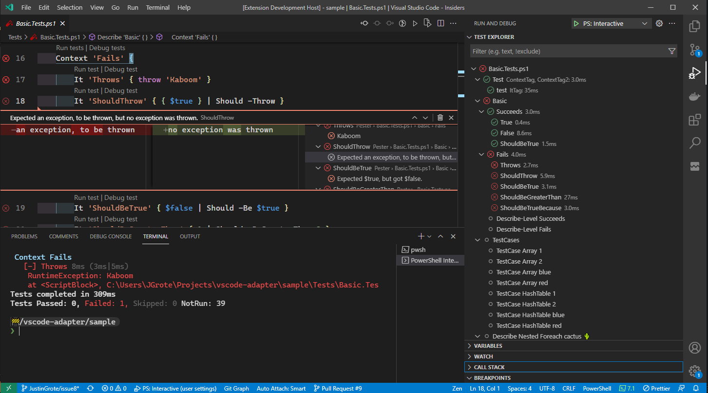

🚧 THIS EXTENSION IS IN PREVIEW STATE, THERE ARE GOING TO BE BUGS 🚧

This extension provides the ability to run [Pester](https://pester.dev/) tests utilizing the native
[Testing functionality](https://code.visualstudio.com/updates/v1_59#_testing-apis) first introduced in Visual Studio Code 1.59

### Highlights

🔍 **Pester Test Browser**  
🐞 **Debugging Support**  
👩‍💻 **Native PowerShell Extension Integration**  
👨‍👧‍👦 **Expands Test Cases**  

### Extension Prerequisites

- Pester 5.2.0 or later (sorry, no Pester 4 support)
- PowerShell 7+ or Windows PowerShell 5.1

### Usage

The extension will automatically discover all `.Tests.ps1` Pester files in your workspace, you can then run tests either
from the Tests pane or from the green arrows that will appear adjacent to your tests.

### Installing the latest preview VSIX

Preview VSIX extension packages are generated upon every commit to main and every pull request update. To install a beta build:

1. Click the green checkmark next to the latest commit
1. Click `Details` next to the `👷‍♂️ Build Visual Studio Code Extension` task
1. Click `Artifacts` in the upper right of the window
1. Download the latest artifact zip and unzip it, it should be named `vsix-{version}`
1. Open the resulting folder in vscode, right click the `.vsix` file, and choose `Install Extension VSIX` near the bottom.
1. Alternatively in vscode you can hit F1 and choose `Extensions: Install from VSIX` and browse for the vsix file.

### Configuration

This extension will use the PowerShell Extension Pester verbosity settings for the output.

### Troubleshooting

The Pester `Output` pane maintains a log of the activities that occur with the Pester extension. You can use `Set Log Level` in the command palette to increase the log level to debug or trace to get more information about what is going on. Include this information when submitting an issue along with reproduction steps.
